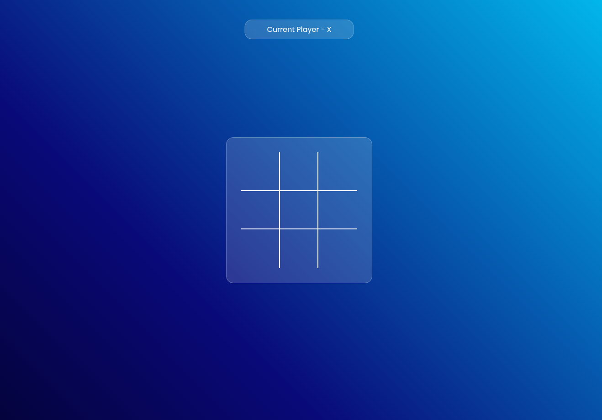
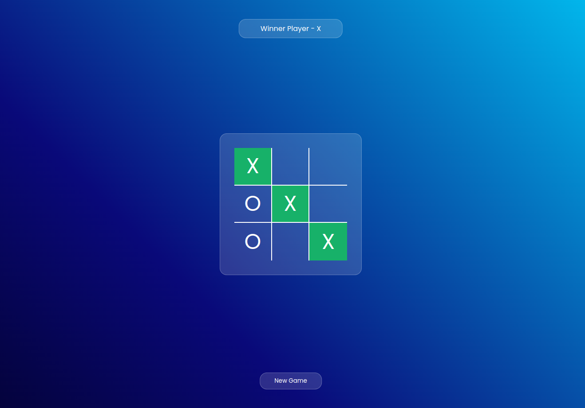

# TIC TAC TOE Project

## Description 
It is a simple tic-tac-toe game website.
This website really helped me to learn and understand concepts of Javascript such as DOM and 
Event Listeners.

## Languages Used
- HTML
- CSS
- Javascript

## Demo 1

## Demo 2
